# 招聘管理系统产品规划文档 (v2.0)

> 文档版本：2.0
> 最后更新：2026-03-04
> 状态：规划中

---

## 目录

1. [产品愿景与定位](#1-产品愿景与定位)
2. [核心用户角色](#2-核心用户角色)
3. [完整招聘流程设计](#3-完整招聘流程设计)
4. [模块功能详细设计](#4-模块功能详细设计)
5. [数据模型设计](#5-数据模型设计)
6. [系统集成与外部接口](#6-系统集成与外部接口)
7. [数据分析与报表](#7-数据分析与报表)
8. [开发路线图](#8-开发路线图)

---

## 1. 产品愿景与定位

### 1.1 产品愿景

打造一款**智能化、全流程、可协作**的招聘管理系统，通过 AI 技术提升招聘效率，优化候选人体验，帮助企业建立标准化、数据驱动的招聘体系。

### 1.2 核心价值主张

| 价值维度 | 目标 |
|---------|------|
| **效率提升** | AI 自动解析简历、生成面试题、撰写评价报告，减少 70% 重复劳动 |
| **决策质量** | 多维度评分、多人协作面试、数据化分析，降低误判率 |
| **候选人体验** | 全流程状态透明、及时通知、灵活的面试安排 |
| **团队协作** | 面试官小组、独立评分、实时进度同步 |
| **合规可溯** | 完整操作日志、评价记录可追溯、数据分析报表 |

### 1.3 产品边界

**包含的功能范围：**
- ✅ 岗位管理
- ✅ 简历收集与筛选
- ✅ 面试安排与执行
- ✅ 笔试/编程测试
- ✅ Offer 管理与入职跟进
- ✅ 数据分析报表

**不包含的功能范围（未来可能扩展）：**
- ❌ 候选人自助门户（C 端产品，建议独立规划）
- ❌ 内推管理系统（可作为独立模块）
- ❌ 薪酬谈判与审批流程

---

## 2. 核心用户角色

### 2.1 角色定义

| 角色 | 英文标识 | 核心职责 | 典型使用场景 |
|------|---------|---------|-------------|
| **系统管理员** | `admin` | 系统配置、用户管理、权限分配 | 配置 LLM 参数、创建用户账号、设置系统参数 |
| **HR 招聘负责人** | `hr` | 岗位发布、简历筛选、面试安排、Offer 发放 | 上传简历、查看 AI 评分、安排面试、确认结果 |
| **面试官** | `interviewer` | 参与面试、评分、撰写评语 | 查看面试题目、录音转写、提交评分、查看综合评价 |
| **候选人** (未来) | `candidate` | 查看进度、确认面试、接收通知 | 查看面试邀请、确认/改期、查看结果 |

### 2.2 权限矩阵

| 功能模块 | admin | hr | interviewer |
|---------|-------|----|-------------|
| 岗位管理 | ✅ 全部 | ✅ 全部 | ❌ 只读 |
| 简历管理 | ✅ 全部 | ✅ 全部 | ✅ 仅分配的 |
| 简历解析/筛选 | ✅ | ✅ | ❌ |
| 面试安排 | ✅ | ✅ | ❌ |
| 面试评分 | ✅ | ✅ | ✅ 仅分配的 |
| 结果确认 | ✅ | ✅ | ✅ 仅分配的 |
| 编程测试管理 | ✅ | ✅ | ⚠️ 部分 |
| 数据分析 | ✅ | ✅ | ❌ |
| 系统设置 | ✅ | ❌ | ❌ |

---

## 3. 完整招聘流程设计

### 3.1 整体流程图

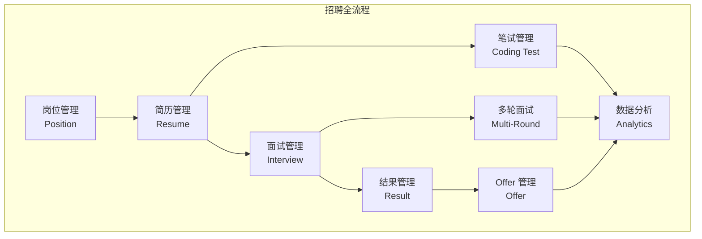

### 3.2 流程概述

招聘管理流程从**岗位需求产生**开始，到**候选人入职**结束，共包含六个主要阶段：

| 阶段 | 名称 | 主要参与人 | 核心产出 | 
|------|------|-----------|---------|
| 1 | 岗位发布 | HR、用人部门 | 已发布的岗位信息 |
| 2 | 简历筛选 | HR、AI 系统 | 通过初筛的候选人 | 
| 3 | 面试安排 | HR、面试官 | 确认的面试计划 | 
| 4 | 面试执行 | 面试官、候选人 | 面试评分与评价 | 
| 5 | 结果管理 | HR、用人部门 | Offer 发放与入职 | 
| 6 | 笔试测试 | 候选人、AI 系统 | 代码评测报告 | 

**流程说明：**

1. **岗位发布**：HR 创建岗位，完善职责描述和任职要求，可选择关联题库用于后续面试
2. **简历筛选**：支持批量上传简历，AI 自动解析并评分，HR 根据 AI 建议进行初筛
3. **面试安排**：为通过初筛的候选人安排面试，选择面试官并生成定制化面试题目
4. **面试执行**：面试官在线查看题目、录音转写、实时评分，多人独立评分后聚合
5. **结果管理**：AI 生成综合评价，HR 确认最终结果，发放 Offer 并跟进入职
6. **笔试测试**：技术岗位可选环节，候选人在线编程，AI 自动判题并评价代码质量

---

### 3.3 详细流程步骤

#### 阶段 1：岗位发布（Positions）

**流程说明：**

岗位发布是招聘流程的起点，由 HR 或用人部门发起。此阶段的目标是明确招聘需求，为后续简历筛选和面试提供标准。

**参与角色：** HR、用人部门负责人

**输入：** 招聘需求（岗位名称、人数、紧急程度）

**输出：** 已发布的岗位信息（状态为 OPEN 或 PUBLISHED）

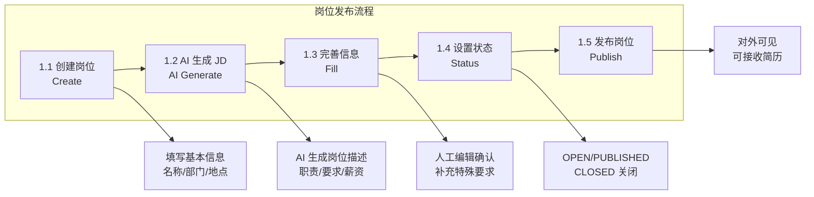

**详细步骤：**

| 步骤 | 操作 | 说明 | 注意事项 |
|------|------|------|---------|
| 1.1 | 创建岗位 | 填写岗位名称、部门、工作地点、汇报对象 | 岗位名称应规范，便于候选人理解 |
| 1.2 | AI 生成 JD | 输入关键词，AI 自动生成岗位职责、任职要求、薪资范围 | 可基于行业/岗位类型选择模板 |
| 1.3 | 完善信息 | 人工编辑 AI 生成的内容，补充特殊要求 | 描述越详细，AI 匹配越准确 |
| 1.4 | 设置状态 | OPEN(开放收集)/PUBLISHED(已发布)/CLOSED(关闭) | OPEN 仅内部可见，PUBLISHED 对外发布 |
| 1.5 | 发布岗位 | 发布到招聘渠道（未来集成） | 支持多渠道发布追踪 |

**状态说明：**
- **OPEN（开放）**：岗位已创建，可接收简历，但未对外发布
- **PUBLISHED（已发布）**：岗位已发布到招聘渠道，对外可见
- **CLOSED（关闭）**：岗位已关闭，不再接收新简历

**业务规则：**
- 岗位必须设置状态为 OPEN 或 PUBLISHED 才能接收简历
- AI 生成 JD 为可选项，用户可选择手动填写或 AI 生成
- 岗位关闭后，已收集的简历仍保留，可继续处理

---

#### 阶段 2：简历收集与筛选（Resumes）

**流程说明：**

简历筛选是招聘流程中最重要的环节之一，直接影响招聘质量。此阶段通过 AI 自动解析、用人部门专业评估、HR 综合决策的多级筛选机制，确保不遗漏优秀人才的同时提高筛选准确性。

**参与角色：** HR、AI 系统、用人部门负责人/技术专家

**输入：** 岗位信息、候选人简历（PDF/Word/TXT）

**输出：** 通过初筛的候选人列表（状态为 PENDING_INTERVIEW）

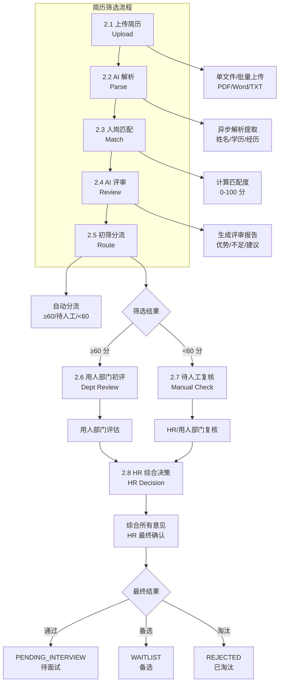

**详细步骤：**

| 步骤 | 操作 | 说明 | 注意事项 |
|------|------|------|---------|
| 2.1 | 简历上传 | 支持单文件/批量上传，格式：PDF/Word/TXT | 上传时自动检测重复简历 |
| 2.1 | 简历查重 | 基于邮箱/手机号检测重复投递 | 发现重复时提示用户处理 |
| 2.2 | AI 解析 | 异步解析：姓名、联系方式、学历、工作年限、最近公司 | 解析状态实时更新 |
| 2.3 | 人岗匹配 | AI 根据岗位 JD 对简历进行匹配度评分 (0-100 分) | 分数仅供参考，不直接决定淘汰 |
| 2.4 | AI 评审 | 生成包含优势、不足、综合建议的评审报告 | 评审报告供后续评估参考 |
| 2.5 | 初筛分流 | ≥60 分→用人部门初评；<60 分→待人工复核 | 低分简历进入人工复核避免误杀 |
| 2.6 | **用人部门初评** | **用人部门负责人/技术专家评估简历专业能力** | **可多人评估，综合专业意见** |
| 2.7 | **待人工复核** | **HR 或用人部门对低分简历进行复核** | **避免 AI 误杀有潜力的候选人** |
| 2.8 | **HR 综合决策** | **HR 综合 AI 评分、用人部门意见，做出最终决定** | **通过/备选/淘汰** |
| 2.9 | 淘汰管理 | 淘汰需选择/填写原因，支持后续查询统计 | 淘汰原因结构化便于分析 |

**简历状态机（优化后）：**

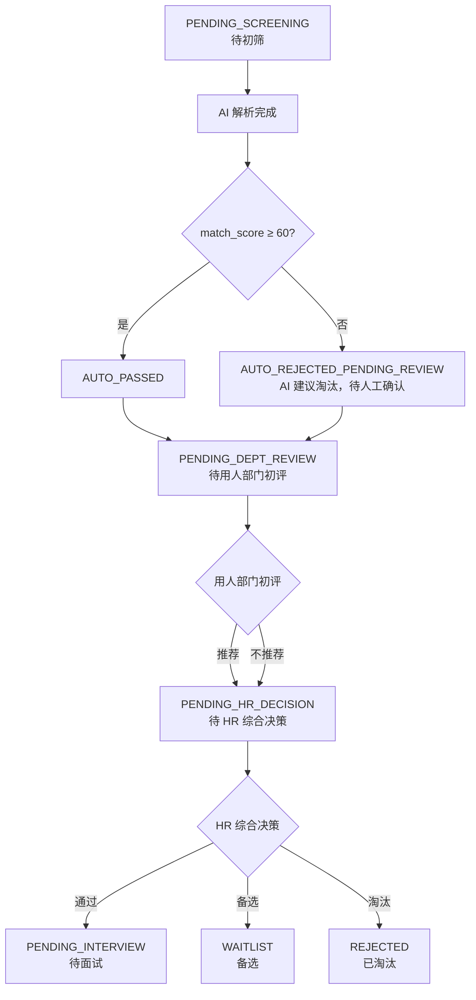

**状态说明：**
- **PENDING_SCREENING**：简历已上传，等待 AI 解析
- **PENDING_DEPT_REVIEW**：AI 解析完成，等待用人部门初评
- **PENDING_HR_DECISION**：用人部门初评完成，等待 HR 综合决策
- **PENDING_INTERVIEW**：HR 决策通过，可安排面试
- **WAITLIST**：备选状态，可暂时不推进
- **REJECTED**：已淘汰，需填写淘汰原因

**业务规则：**
- 简历上传时自动查重，发现重复投递时提示用户
- AI 解析失败时，支持手动重新解析
- 匹配度<60 分的简历不直接淘汰，进入"待人工复核"状态
- **用人部门可指派多人参与初评，综合专业意见**
- **HR 综合 AI 评分、用人部门意见后做出最终决策**
- 任何淘汰操作都必须填写原因，支持结构化选项

**改进点：**
- ⚠️ 低分简历不直接淘汰，进入"待人工确认"状态
- ⚠️ 增加简历查重机制
- ⚠️ 淘汰原因必须填写，支持结构化选项
- ⚠️ **新增用人部门初评环节，发挥专业优势**
- ⚠️ **HR 综合所有意见后决策，避免单方面偏见**

---

#### 阶段 3：面试安排（Interviews）

**流程说明：**

面试安排是将通过初筛的候选人正式纳入面试流程的关键环节。此阶段需要协调面试官时间、生成面试题目，并向候选人发送面试邀请。

**参与角色：** HR、面试官、候选人

**输入：** 通过初筛的候选人（简历状态为 PENDING_INTERVIEW）

**输出：** 已确认的面试安排（状态为 SCHEDULED）

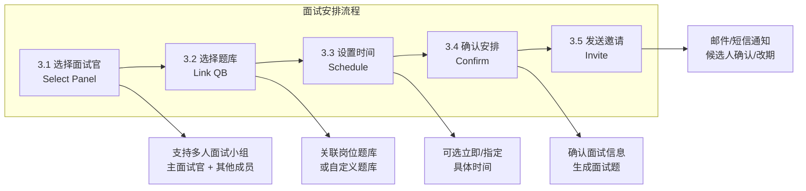

**详细步骤：**

| 步骤 | 操作 | 说明 | 注意事项 |
|------|------|------|---------|
| 3.1 | 选择面试官 | 支持多人面试小组 (panel_members)，设置主面试官 | 可选择多位面试官参与 |
| 3.2 | 选择题库 | 从已绑定该岗位的题库中选择，或选择其他任意题库 | 优先推荐已绑定题库，也可临时选择其他 |
| 3.3 | 设置时间 | 默认立即，可指定具体时间 (支持 UTC 时区) | 需考虑面试官和候选人的时间 |
| 3.4 | 确认安排 | 确认面试类型、轮次、参与人、时间 | 确认后 AI 自动生成面试题 |
| 3.5 | 发送邀请 | 向候选人和面试官发送面试邀请 | 支持邮件/短信通知 |
| 3.6 | 自动提醒 | 提前 1 天/1 小时自动发送提醒 | 提醒候选人和面试官 |

**面试类型说明：**

| 类型 | 英文标识 | 说明 | 适用场景 |
|------|---------|------|---------|
| 技术面 | TECHNICAL | 考察专业技能和项目经验 | 技术岗位初试 |
| HR 面 | HR | 考察综合素质和文化匹配 | HR  screening |
| 主管面 | MANAGER | 考察团队匹配和管理潜力 | 部门经理面试 |
| 终面 | FINAL | 综合评估，决策性面试 | 高管面试 |
| 自定义 | CUSTOM | 根据需求自定义面试类型 | 特殊岗位 |

**业务规则：**
- 支持多轮面试，系统自动计算当前轮次
- 支持多人面试小组，各面试官独立评分
- 面试题目 AI 自动生成，支持手动调整
- 面试邀请包含时间、参与人、面试形式等信息
- 未来支持候选人确认/改期功能
- **题库在上传时已绑定岗位，面试时从已绑定题库中选择**
- 面试题目 AI 自动生成，支持手动调整
- 面试邀请包含时间、参与人、面试形式等信息
- 未来支持候选人确认/改期功能

**改进点：**
- ⚠️ 集成企业日历系统（Outlook/Google Calendar）检查面试官时间冲突
- ⚠️ 候选人收到邀请后可确认或申请改期
- ⚠️ 自动提醒功能完善（已有 `InterviewReminder` 表）

---

#### 阶段 4：面试执行（Interview Score）

**流程说明：**

面试执行是招聘流程的核心环节，面试官通过此环节对候选人进行全面评估。系统支持多人独立评分，确保评估的客观性和准确性。

**参与角色：** 面试官、候选人

**输入：** 已安排的面试（状态为 SCHEDULED）、候选人简历、面试题目

**输出：** 面试评分、评语、AI 综合评价报告

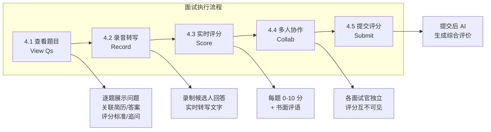

**详细步骤：**

| 步骤 | 操作 | 说明 | 注意事项 |
|------|------|------|---------|
| 4.1 | 查看题目 | 依次展示每道题：问题内容、简历关联、参考答案、评分标准、追问方向 | 题目与候选人经历相关 |
| 4.2 | 录音转写 | 录制候选人回答并转写为文字，支持回放 | 便于后续复盘和 AI 评价 |
| 4.3 | 实时评分 | 每题 0-10 分评分 + 评语 | 评分应客观公正 |
| 4.4 | 多人协作 | 各面试官独立评分，系统显示提交进度 | 评分互不可见，避免从众 |
| 4.5 | 提交评分 | 所有面试官提交后，AI 生成综合评价报告 | 报告包含评分汇总和建议 |

**评分标准：**

| 分数 | 等级 | 说明 |
|------|------|------|
| 9-10 | 优秀 | 远超预期，答案完整且有深度 |
| 7-8 | 良好 | 达到预期，答案基本完整 |
| 5-6 | 合格 | 勉强达到预期，有明显不足 |
| 3-4 | 较差 | 未达到预期，关键知识点缺失 |
| 0-2 | 差 | 完全不符合要求 |

**面板评分聚合逻辑：**

```python
# 当所有面试官都提交后，系统自动：
1. 计算每题平均分
2. 汇总各面试官评语
3. 拼接录音转写内容
4. 调用 AI 生成综合评价
5. 更新主面试记录
```

**业务规则：**
- 面试官独立评分，提交前不可见其他面试官评分
- 系统实时显示提交进度（如"张三已提交评分"）
- 所有面试官提交后，自动触发 AI 综合评价生成
- 支持录音回放，便于复盘和核对
- 面试状态在所有人提交后自动更新为 COMPLETED

**改进点：**
- ⚠️ 录音功能增加预览播放（已有 `audio_records` 字段，需完善 UI）
- ⚠️ 实时显示其他面试官提交状态（如"张三已提交评分"）
- ⚠️ 提供评分指南/示例，统一评分尺度

---

#### 阶段 5：面试结果与 Offer 管理

**流程说明：**

面试结果与 Offer 管理是招聘流程的最后环节，此阶段确认最终面试结果，向通过者发放 Offer，并跟进直至候选人入职。

**参与角色：** HR、用人部门负责人、候选人

**输入：** 已完成的面试（状态为 COMPLETED）、AI 综合评价报告

**输出：** 面试结果确认、Offer 发放、入职状态更新

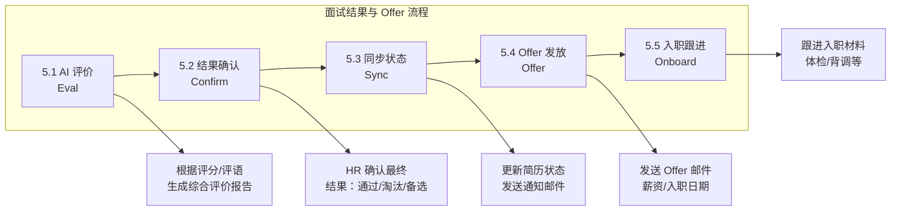

**详细步骤：**

| 步骤 | 操作 | 说明 | 注意事项 |
|------|------|------|---------|
| 5.1 | AI 综合评价 | 根据评分、评语、候选人回答转写生成评价报告 | 报告包含综合评分和建议 |
| 5.2 | 结果确认 | HR 确认最终结果：通过/淘汰/备选 | 可参考 AI 建议，但 HR 有最终决定权 |
| 5.3 | 同步状态 | 自动更新简历状态，发送通知邮件 | 通过者进入 Offer 流程，淘汰者发送感谢信 |
| 5.4 | Offer 发放 | 填写 Offer 信息，发送正式 Offer 邮件 | 包含薪资、入职日期、材料清单 |
| 5.5 | 入职跟进 | 跟进体检、背调、入职材料准备 | 确保候选人顺利入职 |

**结果说明：**

| 结果 | 英文标识 | 说明 | 后续操作 |
|------|---------|------|---------|
| 通过 | PASSED | 候选人通过面试，进入 Offer 流程 | 发放 Offer |
| 备选 | WAITLIST | 候选人表现尚可，但非首选 | 作为备选，首选失败后激活 |
| 淘汰 | REJECTED | 候选人未通过面试 | 发送感谢信，归档简历 |

**结果状态流转：**

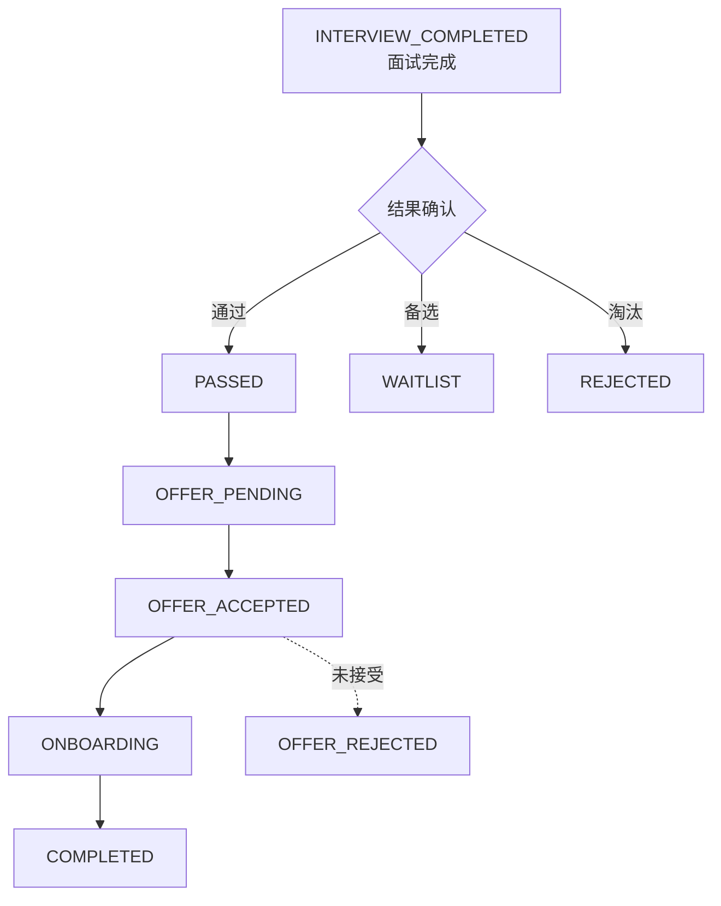

**业务规则：**
- HR 确认结果后，系统自动同步简历状态
- 通过者自动进入 Offer 待发放状态
- 淘汰者简历标记为 REJECTED，可查询但不再推进
- 备选候选人在首选候选人拒绝 Offer 后可被激活
- Offer 接受后，进入入职跟进流程

**改进点：**
- ⚠️ 结果确认后自动通知候选人（邮件模板可配置）
- ⚠️ Offer 流程：薪资确认、入职日期、材料清单
- ⚠️ 入职跟进：体检状态、背调结果、入职材料收集

---

#### 阶段 6：编程测试（Coding Tests）- 可选环节

**流程说明：**

编程测试是技术岗位招聘的可选环节，用于评估候选人的代码能力。可安排在面试前作为筛选条件，或安排在面试后作为补充评估。

**参与角色：** HR、面试官、候选人

**输入：** 编程题题目、测试用例、候选人代码提交

**输出：** 代码评测报告、AI 代码质量评价

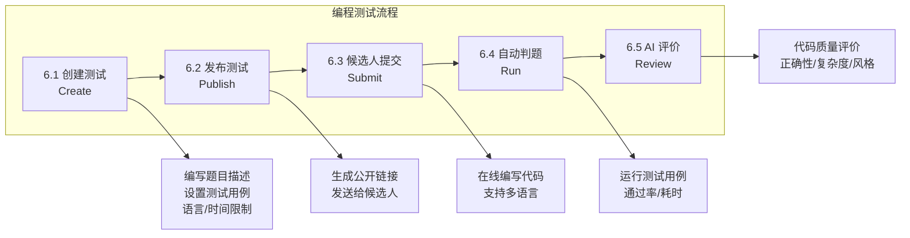

**详细步骤：**

| 步骤 | 操作 | 说明 | 注意事项 |
|------|------|------|---------|
| 6.1 | 创建测试 | 编写题目、设置测试用例、语言限制、时间/内存限制 | 题目可关联岗位或简历 |
| 6.2 | 发布测试 | 生成公开链接，可设置有效期和密码 | 链接通过邮件发送给候选人 |
| 6.3 | 候选人提交 | 在线 IDE 编写代码，支持多语言 | 提交后不可修改 |
| 6.4 | 自动判题 | 运行测试用例，返回通过情况和性能数据 | 显示通过率、执行时间、内存消耗 |
| 6.5 | AI 评价 | 生成代码质量评价（正确性、复杂度、代码风格） | 评价供面试官参考 |

**业务规则：**
- 编程测试为可选环节，可由 HR 决定是否启用
- 可设置"笔试通过后才安排面试"的强约束
- 支持多种编程语言（JavaScript、Python、Java 等）
- 测试用例包含公开用例和隐藏用例
- AI 评价包含代码正确性、时间复杂度、代码风格等维度

**改进点：**
- ⚠️ 与面试流程集成：可设置"笔试通过后才安排面试"的强约束
- ⚠️ 防作弊机制：切屏检测、代码相似度对比
- ⚠️ 题库管理：支持导入 LeetCode 题目（已有 `leetcode_import_service`）
- ⚠️ 防作弊机制：切屏检测、代码相似度对比
- ⚠️ 题库管理：支持导入 LeetCode 题目（已有 `leetcode_import_service`）

---

## 4. 模块功能详细设计

### 4.1 岗位管理模块 (Positions)

**核心功能：**
- 创建/编辑/删除岗位
- 岗位状态管理（OPEN/PUBLISHED/CLOSED）
- 岗位与题库关联
- 岗位列表与筛选

**数据字段：**
```python
class Position(Base):
    id: UUID
    title: str                    # 岗位名称
    description: Text             # 岗位职责
    requirements: Text            # 任职要求
    salary_range: str             # 薪资范围
    location: str                 # 工作地点
    department: str               # 所属部门
    status: PositionStatus        # open/published/closed
    created_at: datetime
    updated_at: datetime
```

**API 接口：**
| 方法 | 路径 | 描述 |
|------|------|------|
| GET | `/api/positions` | 获取岗位列表 |
| GET | `/api/positions/{id}` | 获取岗位详情 |
| POST | `/api/positions` | 创建岗位 |
| PUT | `/api/positions/{id}` | 更新岗位 |
| DELETE | `/api/positions/{id}` | 删除岗位 |

---

### 4.2 简历管理模块 (Resumes)

**核心功能：**
- 简历上传（单文件/批量）
- AI 解析与人岗匹配
- 简历筛选与状态管理
- 简历查重
- 简历列表与筛选

**数据字段：**
```python
class Resume(Base):
    id: UUID
    candidate_name: str         # 候选人姓名
    contact: str                # 联系电话
    email: str                  # 邮箱
    position_id: UUID           # 关联岗位
    file_path: str              # 文件存储路径
    raw_text: Text              # 原始文本内容
    parsed_data: JSON           # AI 解析结果
    match_score: int            # 匹配度评分 (0-100)
    parse_status: str           # processing/success/failed
    screening_result: ScreeningResult  # pending/passed/rejected/waitlist
    ai_review: Text             # AI 评审报告
    hr_review: Text             # HR 评语
    status: ResumeStatus        # 详细状态
    stage: str                  # 看板阶段：new/screening/interview/offer/hired/rejected
    reject_reason: Text         # 淘汰原因
    created_at: datetime
```

**状态枚举：**
```python
class ResumeStatus(str, enum.Enum):
    PENDING_SCREENING = "pending_screening"    # 待初筛
    PENDING_REVIEW = "pending_review"          # 待 HR 评审
    PENDING_INTERVIEW = "pending_interview"    # 待面试
    INTERVIEW_PASSED = "interview_passed"      # 初试通过
    INTERVIEW_FAILED = "interview_failed"      # 初试失败
    OFFER_PENDING = "offer_pending"            # Offer 待定
    OFFER_ACCEPTED = "offer_accepted"          # Offer 已接受
    OFFER_REJECTED = "offer_rejected"          # Offer 已拒绝
    ONBOARDING = "onboarding"                  # 入职中
    COMPLETED = "completed"                    # 已完成
    REJECTED = "rejected"                      # 已淘汰
```

**API 接口：**
| 方法 | 路径 | 描述 |
|------|------|------|
| GET | `/api/resumes` | 获取简历列表 |
| GET | `/api/resumes/{id}` | 获取简历详情 |
| POST | `/api/resumes` | 上传简历 |
| POST | `/api/resumes/batch` | 批量上传 |
| PUT | `/api/resumes/{id}` | 更新简历 |
| DELETE | `/api/resumes/{id}` | 删除简历 |
| POST | `/api/resumes/{id}/reparse` | 重新解析 |

---

### 4.3 面试管理模块 (Interviews)

**核心功能：**
- 创建面试（支持多轮）
- 面试官分配
- 面试时间安排
- 面试题生成
- 面试评分
- 面试结果管理

**数据字段：**
```python
class Interview(Base):
    id: UUID
    resume_id: UUID             # 关联简历
    position_id: UUID           # 关联岗位
    interviewer_id: UUID        # 主面试官 (关联 User)
    interviewer: str            # 面试官显示名 (兼容旧数据)
    interview_type: InterviewType  # technical/hr/manager/final/custom
    round: int                  # 面试轮次
    parent_interview_id: UUID   # 上一轮面试 ID
    interview_time: datetime    # 面试时间 (UTC)
    questions: JSON             # 面试题目列表
    scores: JSON                # 聚合评分
    comments: JSON              # 聚合评语
    total_score: int            # 总分
    panel_members: JSON         # 面试官小组 ID 列表
    audio_records: JSON         # 录音文件路径
    transcripts: JSON           # 转写文本
    result: InterviewResult     # pending/passed/rejected/waitlist
    evaluation: Text            # AI 综合评价
    suggestion: Text            # AI 建议
    status: InterviewStatus     # scheduled/completed/cancelled
    created_at: datetime
```

**面板评分表：**
```python
class InterviewPanel(Base):
    id: UUID
    interview_id: UUID          # 关联面试
    interviewer_id: UUID        # 面试官 (关联 User)
    scores: JSON                # 个人评分
    comments: JSON              # 个人评语
    audio_records: JSON         # 个人录音
    transcripts: JSON           # 个人转写
    total_score: int            # 个人总分
    is_submitted: bool          # 是否已提交
    created_at: datetime
    updated_at: datetime
```

**API 接口：**
| 方法 | 路径 | 描述 |
|------|------|------|
| GET | `/api/interviews` | 获取面试列表 |
| GET | `/api/interviews/{id}` | 获取面试详情 |
| POST | `/api/interviews` | 创建面试 |
| PUT | `/api/interviews/{id}` | 更新面试 |
| DELETE | `/api/interviews/{id}` | 删除面试 |
| POST | `/api/interviews/{id}/score` | 提交评分 |
| POST | `/api/interviews/{id}/panel-score` | 面试官提交评分 |
| POST | `/api/interviews/{id}/aggregate` | 聚合面板评分 |
| POST | `/api/interviews/{id}/confirm-result` | 确认面试结果 |
| GET | `/api/interviews/{id}/export` | 导出面试报告 |

---

### 4.4 编程测试模块 (Coding Tests)

**核心功能：**
- 创建/编辑编程题
- 测试用例管理
- 发布测试链接
- 在线代码编辑器
- 自动判题
- AI 代码评价

**数据字段：**
```python
class CodingTest(Base):
    id: UUID
    title: str                  # 题目标题
    description: Text           # 题目描述
    difficulty: str             # easy/intermediate/hard
    language: str               # 主要语言
    starter_code: Text          # 起始代码
    test_cases: JSON            # 测试用例
    time_limit_ms: int          # 时间限制
    memory_limit_mb: int        # 内存限制
    public_token: str           # 公开访问 token
    status: CodingTestStatus    # draft/published/closed
    created_by: UUID            # 创建者
    resume_id: UUID             # 关联简历 (可选)
    position_id: UUID           # 关联岗位 (可选)
    created_at: datetime
    updated_at: datetime

class CodingSubmission(Base):
    id: UUID
    coding_test_id: UUID        # 关联测试
    candidate_name: str         # 候选人姓名
    candidate_email: str        # 候选人邮箱
    language: str               # 提交语言
    code: Text                  # 提交代码
    run_result: JSON            # 运行结果
    passed: bool                # 是否通过
    score: int                  # 得分
    ai_evaluation: Text         # AI 评价
    status: CodingSubmissionStatus
    created_at: datetime
    submitted_at: datetime
    evaluated_at: datetime
```

**API 接口：**
| 方法 | 路径 | 描述 |
|------|------|------|
| GET | `/api/coding-tests` | 获取测试列表 |
| GET | `/api/coding-tests/{id}` | 获取测试详情 |
| POST | `/api/coding-tests` | 创建测试 |
| PUT | `/api/coding-tests/{id}` | 更新测试 |
| DELETE | `/api/coding-tests/{id}` | 删除测试 |
| GET | `/api/coding-tests/public/{token}` | 公开访问链接 |
| POST | `/api/coding-tests/public/{token}/submit` | 候选人提交 |
| GET | `/api/coding-submissions/{id}` | 获取提交详情 |
| POST | `/api/coding-submissions/{id}/evaluate` | AI 评价 |

---

### 4.5 题库管理模块 (Question Banks)

**核心功能：**
- 题库创建与管理
- 题目导入/导出
- LeetCode 题目导入
- 题库分类与标签
- **上传/创建题库时绑定岗位**

**流程说明：**

题库是面试题目的集合，在上传或创建题库时需要关联到具体岗位，以便在安排面试时 AI 可以基于题库生成定制化题目。

**参与角色：** HR、面试官

**输入：** 题库文件（Markdown/Word/Excel）、岗位信息

**输出：** 已解析的题库，关联到指定岗位

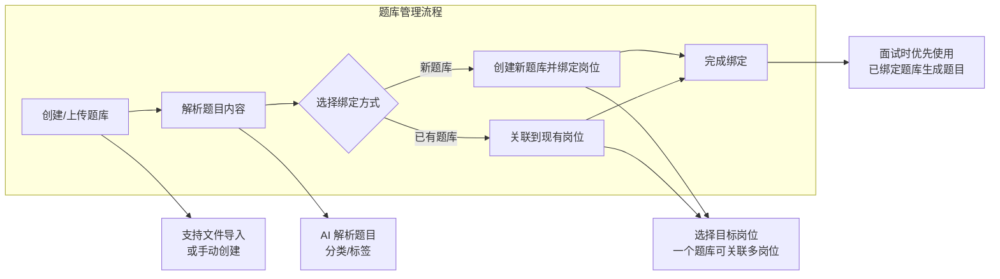

**详细步骤：**

| 步骤 | 操作 | 说明 | 注意事项 |
|------|------|------|---------|
| 1 | 创建/上传题库 | 支持文件导入（Markdown/Word/Excel）或手动创建 | 文件格式需符合规范 |
| 2 | 解析题目内容 | AI 解析文件内容，提取题目、分类、标签 | 解析结果可人工校对 |
| 3 | 绑定岗位 | 选择要关联的岗位，一个题库可关联多个岗位 | 也可在面试安排时临时选择其他题库 |
| 4 | 完成绑定 | 题库与岗位关联成功 | 后续面试可优先使用绑定题库 |

**数据字段：**
```python
class QuestionBank(Base):
    id: UUID
    name: str                   # 题库名称
    category: QuestionCategory  # technical/management/hr/other
    difficulty: QuestionDifficulty  # junior/intermediate/senior
    tags: List[str]             # 标签列表
    questions: JSON             # 题目内容
    source_file: str            # 源文件路径
    position_id: UUID           # 关联岗位 (上传时绑定)
    created_at: datetime
```

**API 接口：**
| 方法 | 路径 | 描述 |
|------|------|------|
| GET | `/api/question-banks` | 获取题库列表 |
| GET | `/api/question-banks/{id}` | 获取题库详情 |
| POST | `/api/question-banks` | 创建题库（可绑定岗位） |
| PUT | `/api/question-banks/{id}` | 更新题库 |
| DELETE | `/api/question-banks/{id}` | 删除题库 |
| POST | `/api/question-banks/import` | 导入题库（绑定岗位） |
| POST | `/api/question-banks/{id}/import-leetcode` | 导入 LeetCode 题目 |
| POST | `/api/question-banks/{id}/link-position` | 关联岗位到已有题库 |

**业务规则：**
- **题库在上传/创建时绑定岗位，而非创建岗位时绑定题库**
- 一个题库可以关联多个岗位
- 一个岗位可以有多个关联题库
- 面试安排时可选择已绑定题库或其他任意题库
- 解绑题库不影响已创建的面试

---

### 4.6 用户与权限模块 (Auth)

**核心功能：**
- 用户注册与登录
- JWT Token 认证
- 角色权限管理
- 用户信息管理

**数据字段：**
```python
class User(Base):
    id: UUID
    email: str                  # 邮箱 (唯一)
    hashed_password: str        # 密码哈希
    full_name: str              # 姓名
    role: UserRole              # admin/hr/interviewer
    is_active: bool             # 是否启用
    created_at: datetime
    updated_at: datetime
```

**API 接口：**
| 方法 | 路径 | 描述 |
|------|------|------|
| POST | `/api/auth/login` | 用户登录 |
| POST | `/api/auth/register` | 用户注册 |
| GET | `/api/users` | 获取用户列表 |
| GET | `/api/users/me` | 获取当前用户 |
| PUT | `/api/users/me` | 更新当前用户 |

---

### 4.7 系统设置模块 (Settings)

**核心功能：**
- LLM 配置（提供商、API Key、模型）
- 邮件服务配置
- 系统参数配置

**数据字段：**
```python
class SystemConfig(Base):
    id: UUID
    llm_provider: str           # dashscope/openai/azure
    llm_base_url: str           # API 基础 URL
    llm_api_key: str            # API 密钥
    llm_model: str              # 模型名称
    llm_temperature: float      # 温度参数
    llm_max_tokens: int         # 最大 token 数
    updated_at: datetime
```

**API 接口：**
| 方法 | 路径 | 描述 |
|------|------|------|
| GET | `/api/settings` | 获取系统配置 |
| PUT | `/api/settings` | 更新系统配置 |

---

### 4.8 数据分析模块 (Dashboard)

**核心功能：**
- 招聘漏斗分析
- 岗位招聘进度
- 渠道效果分析
- 面试官一致性分析
- 时间统计报表

**数据字段：** (聚合查询，无需独立表)

**API 接口：**
| 方法 | 路径 | 描述 |
|------|------|------|
| GET | `/api/dashboard/overview` | 总览数据 |
| GET | `/api/dashboard/funnel` | 招聘漏斗 |
| GET | `/api/dashboard/positions` | 岗位分析 |
| GET | `/api/dashboard/interviewers` | 面试官分析 |
| GET | `/api/dashboard/timeline` | 时间趋势 |

---

## 5. 数据模型设计

### 5.1 ER 关系图

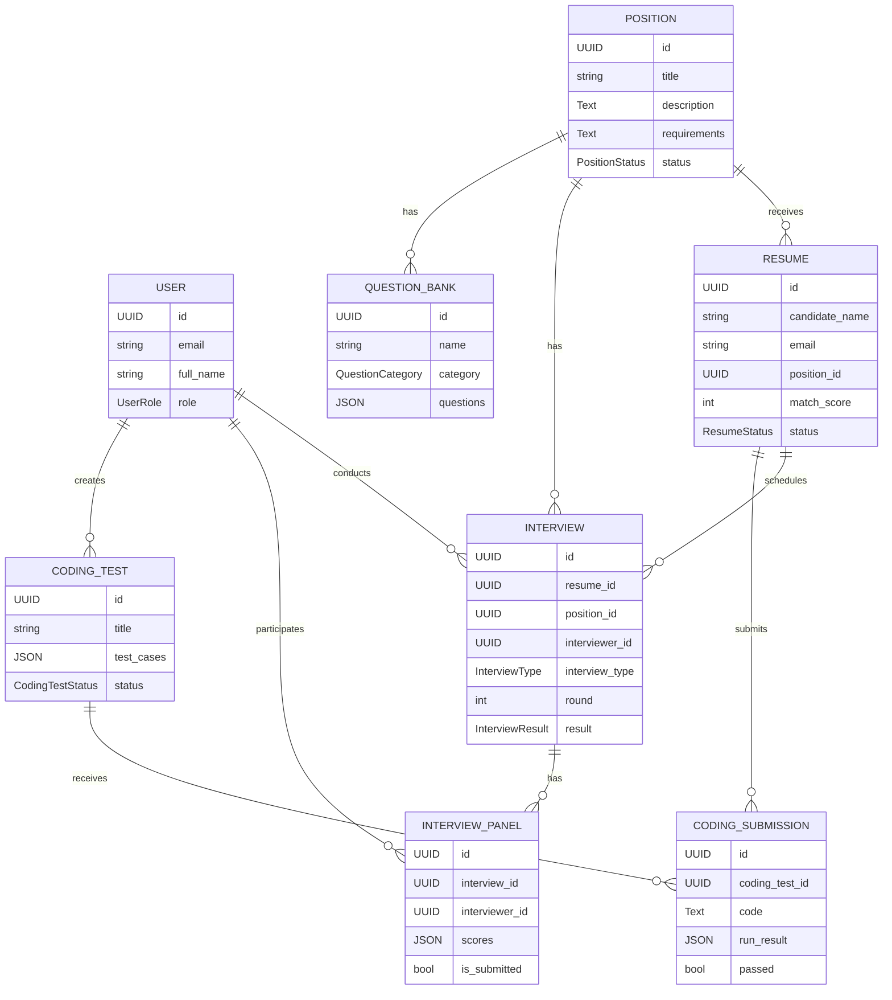

### 5.2 核心表结构汇总

| 表名 | 描述 | 主要字段 |
|------|------|---------|
| `users` | 用户表 | id, email, hashed_password, full_name, role |
| `positions` | 岗位表 | id, title, description, requirements, status |
| `resumes` | 简历表 | id, candidate_name, email, position_id, match_score, status |
| `interviews` | 面试表 | id, resume_id, position_id, interviewer_id, round, questions, result |
| `interview_panels` | 面试评分表 | id, interview_id, interviewer_id, scores, is_submitted |
| `question_banks` | 题库表 | id, name, category, questions, position_id |
| `coding_tests` | 编程测试表 | id, title, test_cases, public_token, status |
| `coding_submissions` | 代码提交表 | id, coding_test_id, code, run_result, ai_evaluation |
| `system_configs` | 系统配置表 | id, llm_provider, llm_api_key, llm_model |
| `interview_reminders` | 面试提醒表 | id, interview_id, remind_at, status |

---

## 6. 系统集成与外部接口

### 6.1 AI 服务集成

| 服务商 | 用途 | 配置项 |
|-------|------|-------|
| DashScope (阿里) | 简历解析、面试题生成、评价报告 | API Key, Model |
| OpenAI | 备用 LLM 提供商 | API Key, Model |
| Azure OpenAI | 企业级部署 | Endpoint, API Key |

### 6.2 邮件服务集成

| 功能 | 触发时机 | 接收人 |
|------|---------|-------|
| 面试邀请 | 面试安排后 | 候选人、面试官 |
| 面试提醒 | 提前 1 天/1 小时 | 候选人、面试官 |
| 结果通知 | 结果确认后 | 候选人 |
| Offer 邮件 | Offer 发放时 | 候选人 |

### 6.3 日历服务集成 (未来)

| 服务商 | 用途 |
|-------|------|
| Google Calendar | 检查面试官时间冲突 |
| Outlook Calendar | 企业日历同步 |
| 飞书日历 | 国内企业集成 |

### 6.4 文件存储

| 类型 | 存储方式 |
|------|---------|
| 简历文件 | 本地存储 / S3 / OSS |
| 录音文件 | 本地存储 / S3 / OSS |
| 图片/头像 | 本地存储 / S3 / OSS |

---

## 7. 数据分析与报表

### 7.1 核心指标

| 指标类别 | 具体指标 | 计算方式 |
|---------|---------|---------|
| **招聘效率** | 平均招聘周期 | Offer 接受时间 - 岗位发布时间 |
| | 简历处理时长 | 初筛完成时间 - 简历上传时间 |
| | 面试安排时长 | 面试时间 - 面试创建时间 |
| **招聘质量** | 面试通过率 | 通过面试数 / 总面试数 |
| | Offer 接受率 | Offer 接受数 / Offer 发放数 |
| | 试用期通过率 | 转正人数 / 入职人数 |
| **渠道效果** | 各渠道简历量 | 按来源统计简历数 |
| | 各渠道转化率 | 各渠道入职数 / 简历数 |
| **面试官** | 评分一致性 | 多面试官评分标准差 |
| | 面试完成率 | 按时完成面试数 / 总分配数 |

### 7.2 报表类型

| 报表名称 | 内容 | 更新频率 |
|---------|------|---------|
| 招聘漏斗 | 各环节转化情况 | 实时 |
| 岗位分析 | 各岗位招聘进度 | 每日 |
| 渠道分析 | 各渠道效果对比 | 每周 |
| 面试官报告 | 面试官表现分析 | 每月 |
| 时间趋势 | 招聘指标时间序列 | 每月 |

---

## 8. 开发路线图

### 8.1 Phase 1：核心功能完善（当前阶段）

**目标：** 完善现有核心功能，修复已知问题

| 模块 | 任务 | 优先级 | 状态 |
|------|------|-------|------|
| 简历管理 | 低分简历人工复核流程 | P0 | 待开发 |
| 简历管理 | 淘汰原因必填 + 结构化选项 | P0 | 待开发 |
| 面试管理 | 录音预览播放功能 | P1 | 待开发 |
| 面试管理 | 面试官提交状态实时显示 | P1 | 待开发 |
| 面试管理 | 自动提醒功能完善 | P1 | 框架已有 |
| 结果管理 | 结果通知邮件 | P1 | 待开发 |

### 8.2 Phase 2：Offer 与入职流程

**目标：** 补全招聘流程最后一公里

| 模块 | 任务 | 优先级 |
|------|------|-------|
| Offer 管理 | Offer 模板配置 | P1 |
| Offer 管理 | Offer 邮件发送 | P1 |
| Offer 管理 | Offer 状态跟踪 | P1 |
| 入职跟进 | 入职材料清单 | P2 |
| 入职跟进 | 体检/背调状态跟踪 | P2 |

### 8.3 Phase 3：数据分析与报表

**目标：** 提供数据驱动的招聘决策支持

| 模块 | 任务 | 优先级 |
|------|------|-------|
| Dashboard | 招聘漏斗可视化 | P1 |
| Dashboard | 岗位招聘进度 | P1 |
| Dashboard | 时间趋势分析 | P2 |
| Dashboard | 面试官一致性分析 | P2 |

### 8.4 Phase 4：候选人门户（独立产品规划）

**目标：** 提升候选人体验

| 模块 | 任务 | 优先级 |
|------|------|-------|
| 候选人门户 | 面试邀请确认/改期 | P2 |
| 候选人门户 | 进度查询 | P2 |
| 候选人门户 | 结果通知接收 | P2 |

### 8.5 Phase 5：高级集成

**目标：** 企业级集成能力

| 模块 | 任务 | 优先级 |
|------|------|-------|
| 日历集成 | Outlook/Google Calendar | P3 |
| 日历集成 | 飞书/钉钉集成 | P3 |
| 内推管理 | 内推链接生成与追踪 | P3 |
| 内推管理 | 内推激励管理 | P3 |

---

## 附录

### A. 现有代码文件结构

```
backend/app/
├── main.py                     # FastAPI 应用入口
├── models/
│   ├── base.py                 # 模型基类
│   └── models.py               # 数据模型定义
├── schemas/                    # Pydantic 模式
│   ├── resume.py
│   ├── interview.py
│   ├── position.py
│   ├── question_bank.py
│   ├── coding_test.py
│   ├── user.py
│   └── settings.py
├── routes/                     # API 路由
│   ├── resumes.py
│   ├── interviews.py
│   ├── positions.py
│   ├── question_banks.py
│   ├── coding_tests.py
│   ├── auth.py
│   └── settings.py
├── services/                   # 业务逻辑
│   ├── resume_service.py
│   ├── interview_service.py
│   ├── position_service.py
│   ├── question_bank_service.py
│   ├── coding_test_service.py
│   ├── ai_service.py
│   ├── reminder_service.py
│   └── auth.py
└── utils/                      # 工具函数
    ├── file_storage.py
    ├── security.py
    └── prompt_manager.py
```

### B. 已知问题汇总

| 问题 | 影响 | 建议方案 |
|------|------|---------|
| 初筛仅靠 AI 评分 | <60 分自动淘汰可能误杀 | 增加"待人工确认"状态 |
| 无候选人确认环节 | 面试时间未经候选人确认 | 增加面试邀请确认流程 |
| 录音功能不完善 | 只能录不能回放 | 增加录音预览播放 |
| 结果确认后无通知 | 候选人等待时间过长 | 自动发送通知邮件 |
| Offer 流程缺失 | 通过后无后续跟进 | 增加 Offer 管理模块 |
| 无数据统计分析 | 无法评估招聘效果 | 增加数据分析 Dashboard |

### C. 术语表

| 术语 | 英文 | 解释 |
|------|------|------|
| 人岗匹配 | Person-Job Fit | AI 评估候选人与岗位的匹配程度 |
| 面试小组 | Interview Panel | 参与同一场面试的多位面试官 |
| 多轮面试 | Multi-round Interview | 候选人依次通过多轮不同面试官 |
| 招聘漏斗 | Recruitment Funnel | 从简历到入职各环节的转化分析 |

---

**文档结束**
